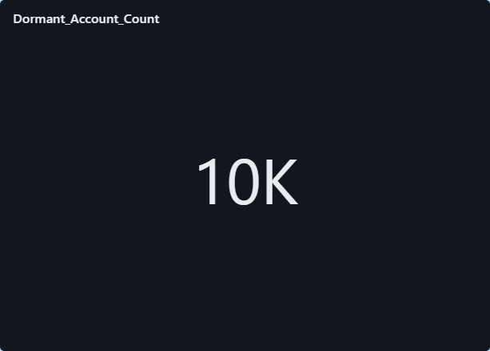

# Banking Data Engineering End-to-End Pipeline

## Overview

This project implements an end-to-end **Banking Data Engineering pipeline** using **AWS S3** and **Databricks (Apache Spark)**. The pipeline follows a **Bronze → Silver → Gold** layered architecture and produces **business-ready datasets** that are visualized using **Databricks SQL dashboards**.

All data in this project is processed and stored as **CSV files** in S3 (no Delta Lake, no Parquet).

---

## Architecture

Source CSV (S3)
→ Bronze Layer (Raw CSV)
→ Silver Layer (Cleaned CSV)
→ Gold Layer (Aggregated CSV)
→ Databricks SQL Dashboards

---

## Technology Stack

* AWS S3 – Data storage
* Databricks – Apache Spark processing
* Databricks SQL – Dashboards & analytics
* AWS IAM Roles – Secure S3 access
* PySpark – Data transformations
* SQL – Validation and analytics

---

## Data Layers

### Source Layer

* customers.csv
* accounts.csv
* transactions.csv

### Bronze Layer

* Raw copy of source data
* No transformations applied
* Stored as CSV in S3

### Silver Layer

* Duplicate records removed
* Null values filtered
* Invalid transaction amounts removed
* Transaction types standardized
* Cleaned CSV data stored in S3

### Gold Layer

Business-ready aggregated datasets:

* Total transaction amount per day
* High value transactions
* Dormant accounts
* Total balance per customer
* Account transaction count

---

## Project Structure

```
banking-data-engineering-pipeline/
├── dashboards/
│ ├── dashboard_screenshots/
│ │ ├── Dormant Account Count.png
│ │ ├── High Value Transactions.png
│ │ └── Total Transaction Amount Per Day.png
│ └── databricks_sql_queries/
│ ├── branch_performance.sql
│ ├── daily_transactions.sql
│ └── high_value_txn.sql
│
├── data/
│ ├── source/
│ │ ├── accounts/
│ │ │ └── accounts.csv
│ │ ├── customers/
│ │ │ └── customers.csv
│ │ └── transactions/
│ │ └── transactions.csv
│ ├── bronze/
│ │ └── README.md
│ ├── silver/
│ │ └── README.md
│ └── gold/
│ └── README.md
│
├── databricks/
│ ├── bronze/
│ │ ├── accounts_bronze.ipynb
│ │ ├── customers_bronze.ipynb
│ │ └── transactions_bronze.ipynb
│ ├── silver/
│ │ ├── accounts_silver.ipynb
│ │ ├── customers_silver.ipynb
│ │ └── transactions_silver.ipynb
│ └── gold/
│ ├── account_transaction_count.ipynb
│ ├── dormant_accounts.ipynb
│ ├── high_value_transactions.ipynb
│ ├── total_balance_per_customer.ipynb
│ └── total_transaction_amount_per_day.ipynb
│
├── docs/
│ ├── architecture.md
│ ├── dashboard.md
│ ├── data_model.md
│ ├── pipeline_flow.md
│ ├── runbook.md
│ ├── security.md
│ ├── storage_strategy.md
│ └── validation.md
│
├── sql/
│ ├── schema.sql
│ ├── validation_queries.sql
│ └── data_quality_queries.sql
│
├── tests/
│ └── data_quality_checks.sql
│
├── workflows/
│ └── databricks_jobs.json
│
├── README.md
└── requirements.txt

```

---

## Incremental Processing

* Transaction data is processed incrementally
* Bronze and Silver layers append new data
* Gold layer aggregates are recalculated from clean data
* Pipeline is idempotent and safe to re-run

---

## Data Quality Checks

The pipeline includes basic SQL-based data quality checks:

* Record count validation between layers
* Duplicate transaction ID detection
* Null checks on key columns
* Invalid amount validation
* Business rule validation for high value transactions

Data quality queries are available under:

* sql/validation_queries.sql
* sql/data_quality_queries.sql

---

## Dashboards

Databricks SQL dashboards are created on top of **Gold layer CSV datasets** to provide business and operational insights.

## Dashboards

Databricks SQL dashboards are created on top of **Gold layer CSV datasets** to provide business and operational insights.

### Dashboard: Banking Analytics Overview

The following dashboards are included in this project and stored under `dashboards/dashboard_screenshots/`:

### Dormant Account Count
Shows the total number of inactive (dormant) bank accounts.



---

### High Value Transactions
Displays transactions above the defined threshold for risk and fraud monitoring.


---

### Total Transaction Amount Per Day
Line chart showing daily transaction volume trends.


---

These dashboards demonstrate how curated gold data is consumed for analytics and decision-making.

---

## Security

* AWS IAM Roles are used for secure S3 access
* No AWS access keys are stored in code or configuration files
* Databricks clusters access S3 using attached IAM roles
* Access is limited to required S3 paths only

---

## Pipeline Execution Steps

1. Upload source CSV files to S3
2. Run Bronze Databricks notebooks
3. Run Silver Databricks notebooks
4. Run Gold Databricks notebooks
5. Execute data quality validation queries
6. Refresh Databricks SQL dashboards

---

## Author

**Sanket Aba Adhav**
Aspiring Data Engineer
